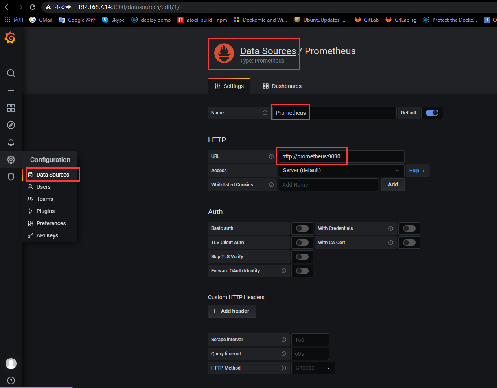
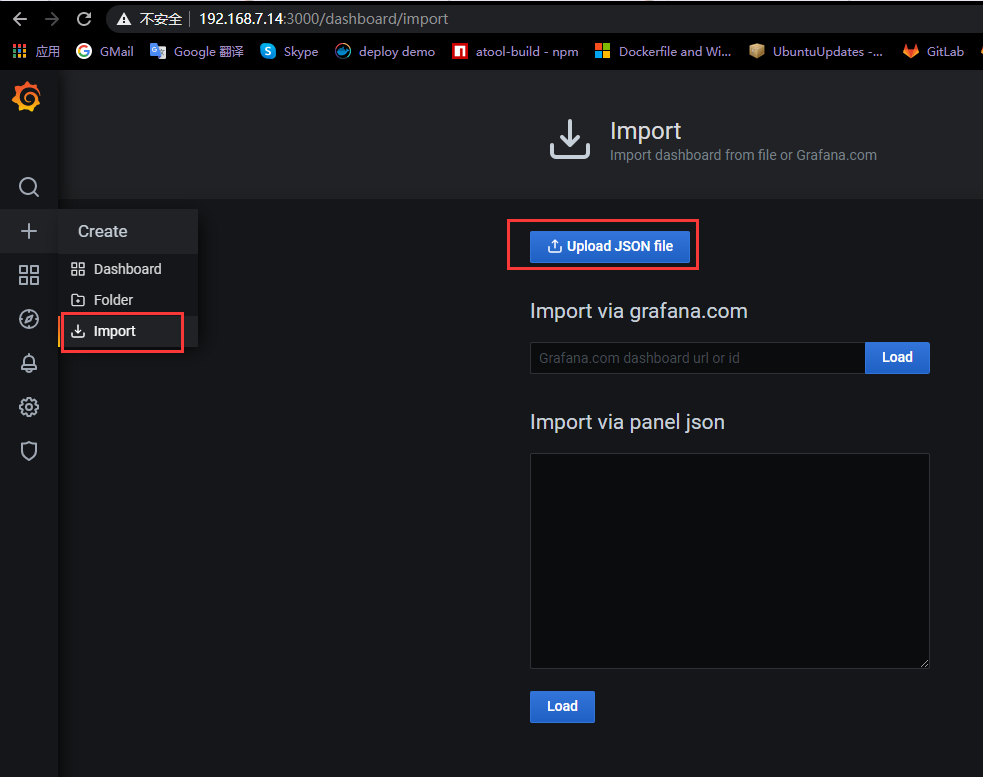

1. 环境<br>
>>VM(ubuntu) <br>
>>docker<br>
>>docker-compose<br>

2. 启动监控(以ubuntu为例)<br>
* 创建文件夹<br>
````
    cd /home/ubuntu
    sudo mkdir prometheus
    sudo mkdir moniting
    sudo mkdir grafana
    sudo chmod -R 777 prometheus
    sudo chmod -R 777 moniting
    sudo chmod -R 777 grafana
````

* windows安装export<br>
将windows_exporter-0.14.0.exe文件copy到windows server任意目录下，使用CMD进入到此目录下<br>
执行启动命令
````
     .\windows_exporter-0.14.0 --collectors.enabled "system,cpu,cs,logical_disk,net,os,service,iis"
````
访问http://<windows ip>:9182/metrics查看是否启动成功

* 启动grafana<br>
将moniting文件夹下的文件copy到/home/ubuntu/moniting下<br>
修改egp-nodes-inter.json文件targets label中的 ip<br>
GF_SECURITY_ADMIN_PASSWORD 中定义了grafana登录的密码 ，用户是admin<br>
修改EE-moniting.yml文件中的注释项<br>
````
    sudo docker-compose -f EE-moniting.yml up -d
````
访问http://<ip>:9091/graph，http://<ip>:3000，http://<ip>:9104，http://<ip>:9913，http://<ip>:4000查看是否启动成功<br>

3. 成功启动后，访问`http://<ip>:3000`，默认admin/password$1<br>
   创建数据库Prometheus<br>

   导入dashboards，json文件在dashboard文件夹下中<br>



